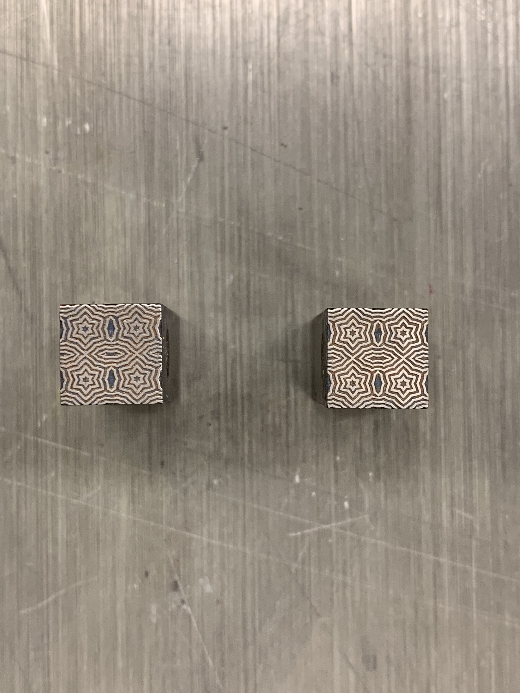

Today I found in the workshop a some cases with «Elementarschmuck»

Patterns for security prints

And a case with all the same patern

Some of them have markings on the side

The pin marks (Gießmarke) indicate they are comming from [Schelter & Giesecke](https://en.wikipedia.org/wiki/Schelter_%26_Giesecke_Type_Foundry)
