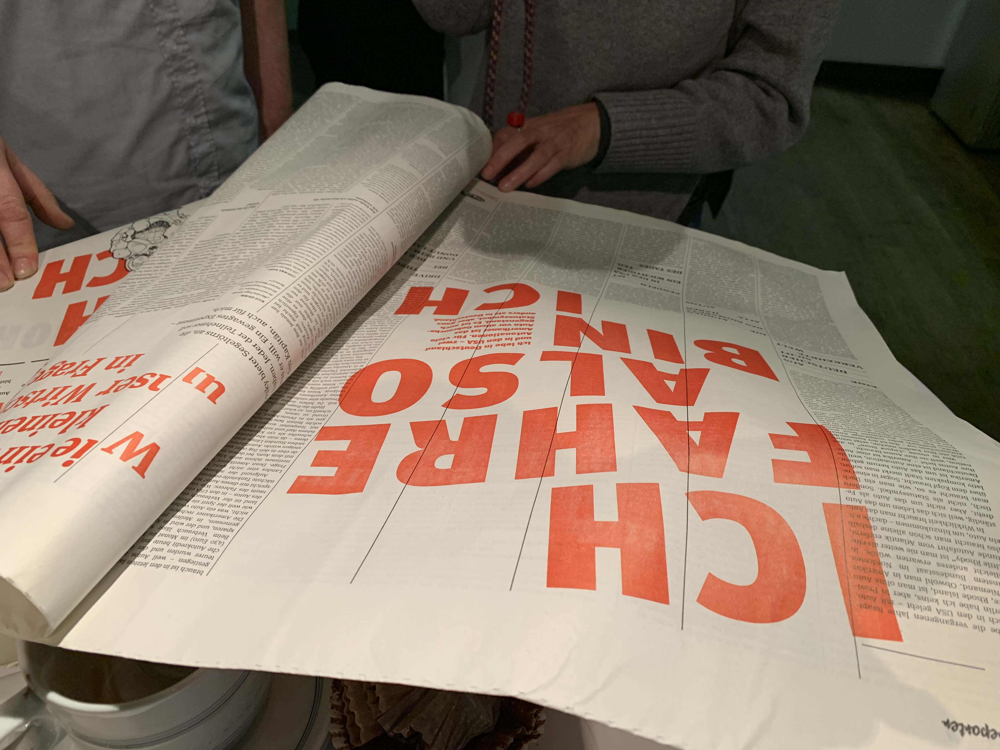
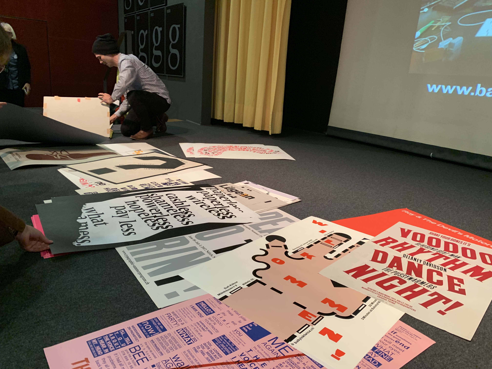

This weekend was the second run of the conference [«Transformationen des Buchdrucks»](https://web.archive.org/web/20181118222128/https://www.interdisciplinary-laboratory.hu-berlin.de/de/content/transformationen-des-buchdrucks-2-haptiken/?content_type=mitglied) (Transformation of letter press) with the topic «Haptiken» (haptics). Where as the first conference two years ago was held in Berlin this time the [«Gutenberg-Museum Mainz»](http://www.gutenberg-museum.de/) opened it's doors.

There were many people from all over Germany and even some international Guests. The broad range of Speakers gave a good overview of several different Topics right now happening in the field of letter press.

Daniel Klotz of the company [Lettertypen](https://www.lettertypen.de/) showed us during a break an output of his 1924 built press (Johannisberger Schnellpresse).

[Dafi Kühne](https://www.babyinktwice.ch/) after his talk showed the originals produced in his workshop. He also showed us his new Video-Series the [Printing Show™](https://vimeo.com/channels/printingshow).
