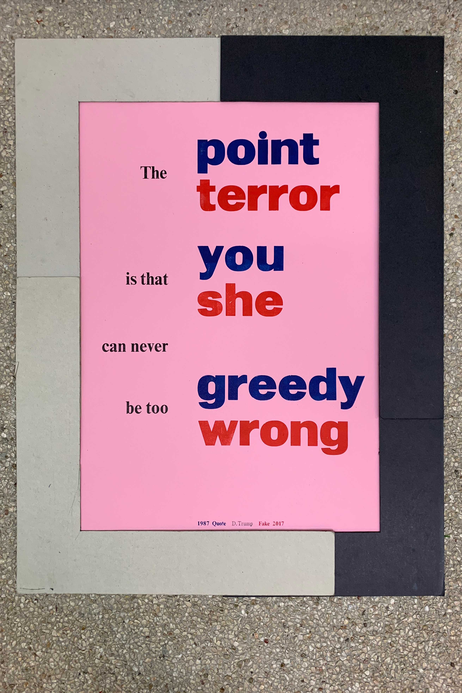
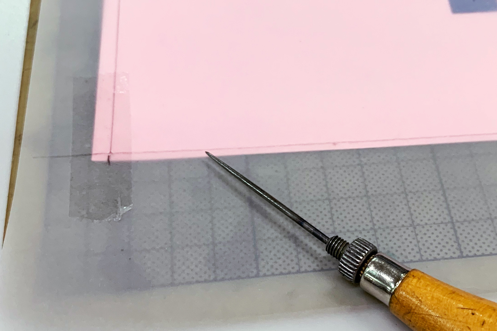

## Finding the right crop

To figure out the final crop I usually put masks – made out of gray cardboard – on the print. I consider the final proportion of the format and try to have some rational numbers (2:3, 3:5, ...).

## Making a Mask

After I found the right spot I make a mask with tracing paper. On the tracing paper I make some markings of the print so I can easily place it on the next print. I take care its correct 90° angeled so the final product will not end up as rhomubs. In the corners I place a transparent tape to punch with the stitching awl through and mark therefore my final format on the print. Now I'm able to crop it with a cutter.

### Thanks
Thanks to [Rudolf Barmettler](https://www.zhdk.ch/person/10417) for showing me this technic
