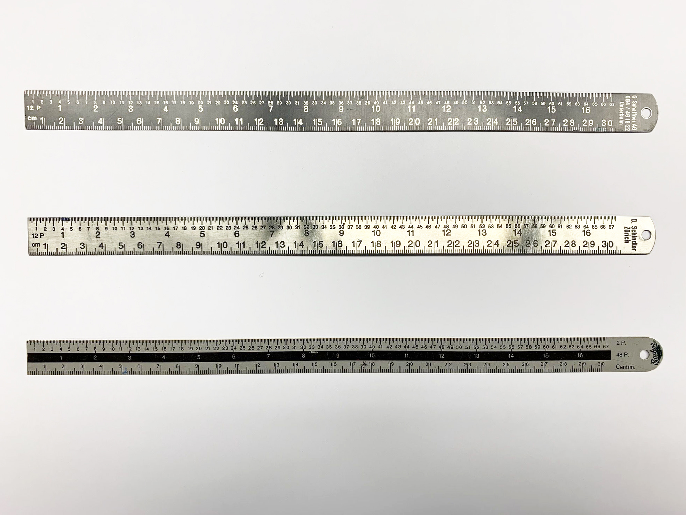
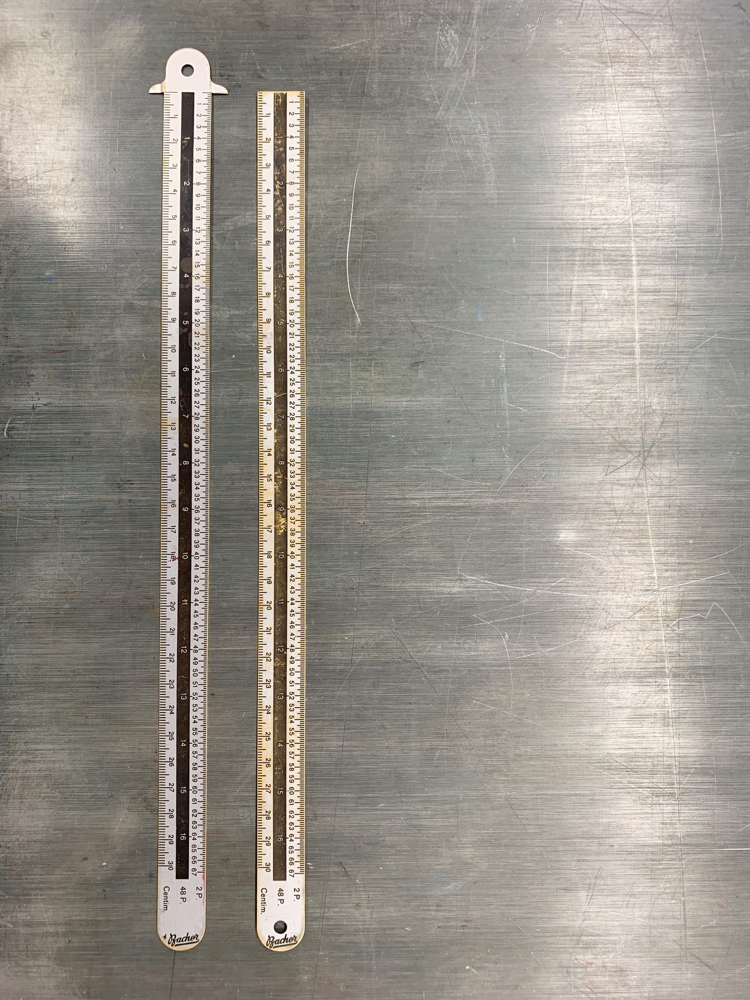
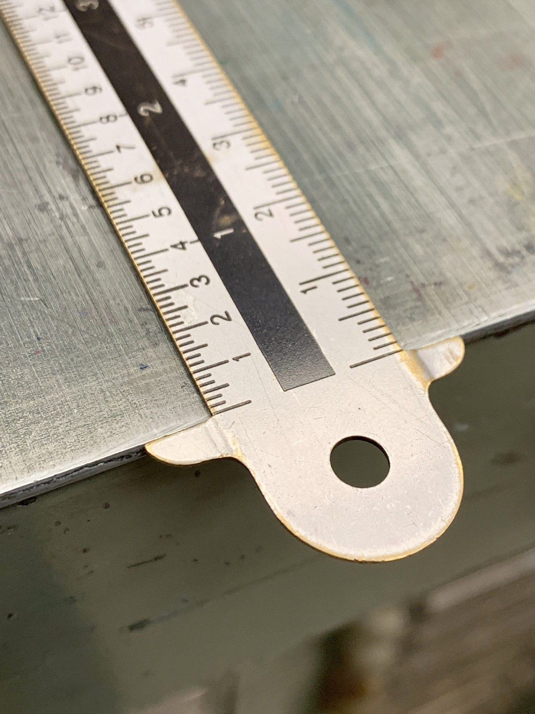
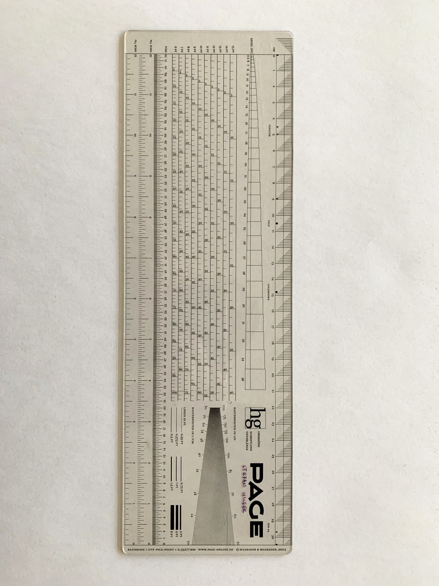
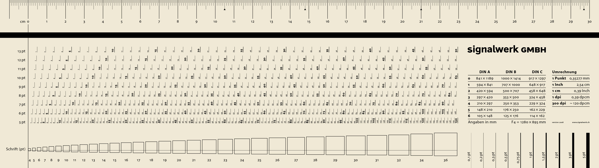
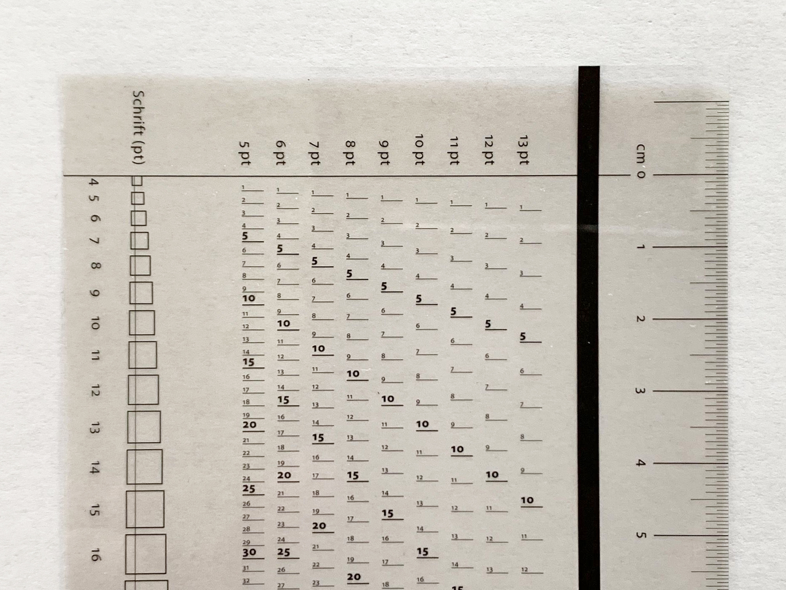

## Typometers for Typesetting
I found several old typometers.

For a typometer made by a company called «Bacher» I found two versions:

The one with the «wings» is probably one of my favorites;

## 1997 – Who remembers «DTP»?!

When I startet 1997 my apprenticeship I got my first typometer from the company/magazine [Page](https://page-online.de/tools-technik/25-jahre-page-dtp-typometer/). The design was quite good and I really liked to work with it. It was – of course – tailored for the use in a «Desktop Publishing»-Context and served really well my needs.

## 2008 - First DIY

A couple years later I made my own typometer. This design was inspired by my first typometer but I made some changes to scales I never needed (Inces) and adjusted the line-register slightly:

## 2019 - First Typesetting
I made some first attempts to design my own typesetting typometer...

