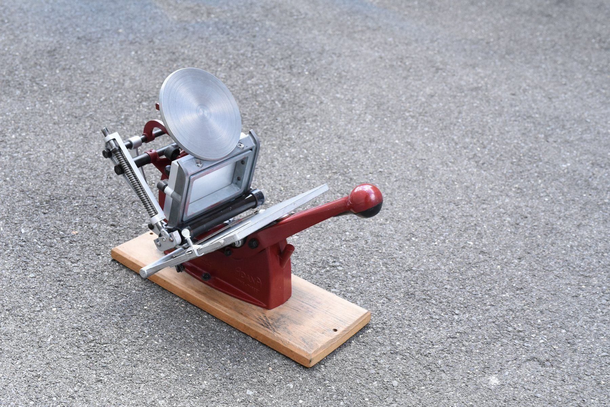

import Box from 'gatsby-theme-signalwerk/src/components/Box';

## My first platen machine
This weeke I found a quite affordable letterpress printing machine on a secondhand online market. The price was quite good so I decided to order the tiny machine. It's a 5 × 3 Inch platen machine of the brand «Adana». You can even get replacement parts from the [compoany](http://caslon.co.uk/) who made it.

